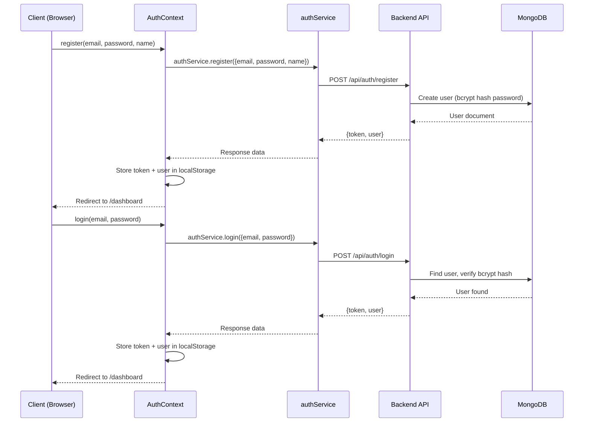
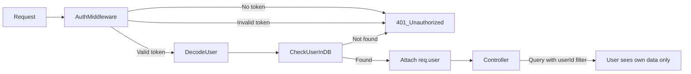
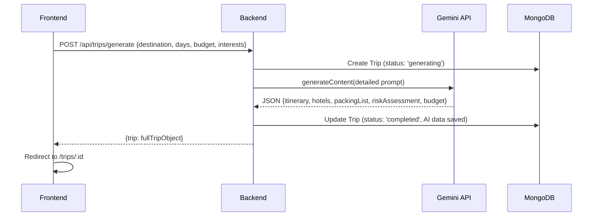

# Trao AI Travel Planner — Project Workflow

## Overview

Trao is a full-stack AI-powered travel planning application built with Next.js 16 (frontend), Node.js/Express (backend), MongoDB Atlas (database), and Google Gemini 2.5 Flash (AI engine).

---

## 1. Requirement Analysis

### Core User Requirements
- User registration and login with JWT authentication
- AI-generated trip itineraries (day-by-day)
- Budget estimation per destination and budget tier
- Hotel recommendations (budget / mid-range / luxury)
- Smart packing assistant with weather-aware checklists
- Trip risk assessment scoring system
- Editable itinerary (add/remove/edit activities per day)
- Ability to regenerate any single day using custom AI instructions
- Packing list with checkoff functionality
- Trip deletion with confirmation
- Protected routes for authenticated users only

### Non-Functional Requirements
- JWT-based stateless authentication
- Per-user data isolation (users cannot access each other's trips)
- Rate limiting on AI generation endpoints (prevent abuse)
- CORS configuration for frontend/backend separation
- Responsive UI for all screen sizes
- 60-second timeout for AI API calls

---

## 2. Architecture Design

```mermaid
graph TD
    A[Next.js 16 Frontend] -->|HTTP REST via Axios| B[Express.js Backend]
    B -->|Mongoose ODM| C[MongoDB Atlas]
    B -->|@google/generative-ai| D[Gemini 2.5 Flash API]
    A -->|Context API| E[AuthContext + TripContext]
    E -->|Services| F[authService + tripService]
    F -->|Axios Instance| B
```

### Directory Structure
```
Trao/
├── backend/                    # Node.js / Express API
│   ├── src/
│   │   ├── config/             # database.js, env.js
│   │   ├── controllers/        # authController.js, tripController.js
│   │   ├── middleware/         # auth.js, errorHandler.js, rateLimiter.js, validate.js
│   │   ├── models/             # User.js, Trip.js
│   │   ├── routes/             # authRoutes.js, tripRoutes.js
│   │   ├── services/           # geminiService.js
│   │   ├── utils/              # jwt.js, response.js
│   │   └── server.js
│   ├── .env                    # Environment variables (local)
│   ├── .env.example            # Template for deployment
│   ├── package.json
│   └── render.yaml             # Render deployment config
│
├── frontend/                   # Next.js 16 App Router
│   ├── app/
│   │   ├── layout.js           # Root layout with Providers
│   │   ├── globals.css         # Design system / CSS tokens
│   │   ├── page.js             # Landing page
│   │   ├── login/page.js       # Login form
│   │   ├── register/page.js    # Registration form
│   │   ├── dashboard/page.js   # Main authenticated dashboard
│   │   ├── trips/page.js       # All trips list page
│   │   └── trips/[id]/page.js  # Trip detail with tabs
│   ├── components/             # Reusable UI components
│   ├── context/                # AuthContext, TripContext
│   ├── services/               # api.js, authService.js, tripService.js
│   └── lib/                    # validations.js, utils.js
│
└── docs/                       # Project documentation
```

---

## 3. Database Design

### User Model
```javascript
{
  _id: ObjectId,
  name: String (required, 1-100 chars),
  email: String (unique, required, lowercase),
  password: String (bcrypt hashed, min 6 chars with number),
  createdAt: Date,
  updatedAt: Date
}
```

### Trip Model
```javascript
{
  _id: ObjectId,
  userId: ObjectId (ref: User, required — data isolation),
  destination: String (required, max 100),
  durationDays: Number (1-30),
  budgetTier: Enum ['low', 'medium', 'high'],
  interests: [Enum: food|culture|adventure|shopping|nature|nightlife|family|history],
  status: Enum ['generating', 'completed', 'failed'],
  itinerary: [{
    day: Number,
    theme: String,
    activities: [{
      _id: ObjectId,
      time: String,
      title: String,
      description: String,
      estimatedCost: Number,
      category: String
    }]
  }],
  estimatedBudget: {
    accommodation: Number,
    food: Number,
    transport: Number,
    activities: Number,
    misc: Number,
    totalEstimate: Number,
    currency: String,
    notes: String
  },
  hotels: [{
    tier: String,
    name: String,
    priceRange: String,
    description: String,
    amenities: [String],
    rating: Number
  }],
  packingList: [{
    _id: ObjectId,
    item: String,
    category: Enum,
    completed: Boolean
  }],
  riskAssessment: {
    overallScore: Number (1-10),
    level: String,
    factors: [{
      category: String,
      score: Number,
      description: String
    }],
    recommendations: [String]
  },
  createdAt: Date,
  updatedAt: Date
}
```

---

## 4. Authentication Flow



**JWT Persistence:**
- Token stored in `localStorage` key `trao_token`
- User object stored in `localStorage` key `trao_user`
- On app load, `AuthContext` reads both from localStorage to restore session
- Axios interceptor automatically attaches `Bearer <token>` to all requests
- On 401 response, interceptor clears localStorage and redirects to `/login`

---

## 5. Authorization Flow



**Data Isolation Pattern** (every trip query):
```javascript
Trip.find({ _id: id, userId: req.user._id })
```

---

## 6. AI Workflow



**Gemini Prompt Engineering:**
- System instruction for strict JSON output
- Includes: destination, duration, budget tier, interests
- Generates 5 components simultaneously: itinerary (per-day), hotels (3 tiers), packing list (categorized), risk assessment (scored), budget breakdown
- `responseMimeType: 'application/json'` enforces JSON-only output
- Fallback JSON parsing with error recovery

**Day Regeneration Flow:**
```
PATCH /api/trips/:id/regenerate-day
→ Backend fetches trip context
→ Gemini regenerates ONLY that day
→ MongoDB updates only that day's activities
→ Returns full updated trip
```

---

## 7. Deployment Workflow

### Backend (Render)
1. Push to GitHub
2. Render detects `render.yaml`
3. Runs `npm install && node src/server.js`
4. Environment variables set in Render dashboard:
   - `MONGO_URI` (MongoDB Atlas connection string)
   - `JWT_SECRET` (strong random secret)
   - `GEMINI_API_KEY` (from Google AI Studio)
   - `FRONTEND_URL` (deployed frontend URL)
   - `NODE_ENV=production`

### Frontend (Vercel)
1. Push to GitHub
2. Vercel detects Next.js project in `/frontend`
3. Runs `npm run build` automatically
4. Environment variable set in Vercel dashboard:
   - `NEXT_PUBLIC_API_URL` (deployed Render backend URL)

### Environment Variable Flow
```
Local Dev:  frontend/.env.local → NEXT_PUBLIC_API_URL=http://localhost:5000
Local Dev:  backend/.env → MONGO_URI, JWT_SECRET, GEMINI_API_KEY

Production: Vercel → NEXT_PUBLIC_API_URL=https://trao-api.onrender.com
Production: Render → MONGO_URI, JWT_SECRET, GEMINI_API_KEY, FRONTEND_URL
```
